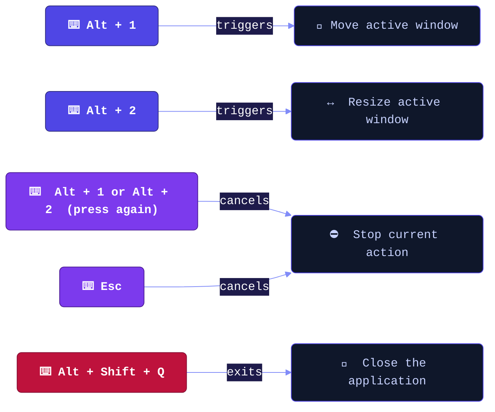
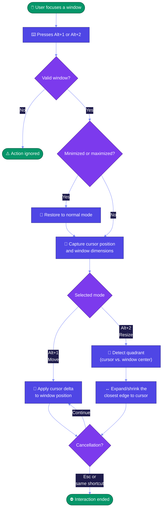
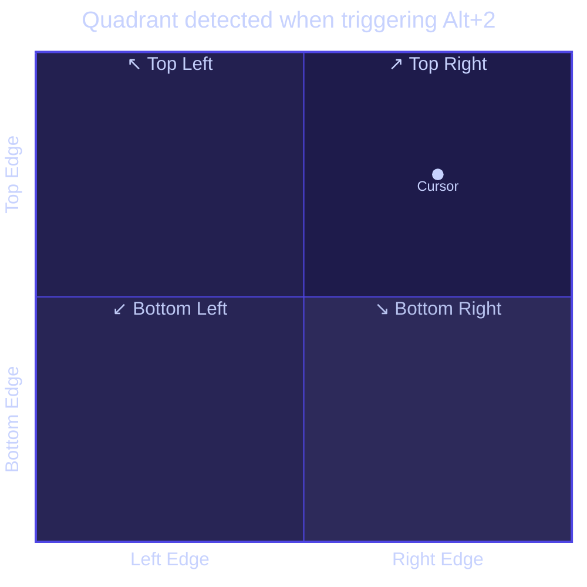

# 🪟 WindowsResize

> **Control your windows with elegance — no grabbing borders, no dragging the title bar.**

WindowsResize is a lightweight utility for **Windows**, written in **C++20**, that runs quietly in the background and turns any keyboard shortcut into a powerful window move and resize command — inspired by the classic utility from **Ubuntu/GNOME**.

---

## ✨ Why use it?

On Windows, moving or resizing a window requires precision: you need to click exactly on the title bar or the edges — especially the thin edges, which can be frustrating. WindowsResize solves this intuitively:

- 🔑 Press a shortcut
- 🖱️ Move the mouse wherever you want
- ✅ Press the shortcut again (or `Esc`) to confirm

That simple. Works with **any window** on the system.

---

## 🚀 Features

| Feature | Description |
|---|---|
| 🔄 **Move windows** | Moves the active window using the mouse, without clicking on the title bar |
| ↔️ **Resize windows** | Resizes the window from the edge closest to the cursor |
| 🖥️ **System tray** | Tray icon indicates the app is active |
| ⚡ **High frequency** | Updates at ~125Hz (every 8ms) for ultra-smooth movement |
| 🪶 **Lightweight and discreet** | Hidden window, no UI, zero performance impact |
| 🔁 **Auto-restore** | Minimized or maximized windows are restored before interaction |

---

## ⌨️ Keyboard Shortcuts



### Quick reference

| Shortcut | Action |
|---|---|
| `Alt + 1` | 🔄 Start/cancel **move** mode for the active window |
| `Alt + 2` | ↔️ Start/cancel **resize** mode for the active window |
| `Esc` | ⛔ Cancel any ongoing action |
| `Alt + Shift + Q` | 🚪 Exit the application |

---

## 🔍 How it works



### Resize logic details

When pressing `Alt + 2`, the app detects **which quadrant of the window the cursor is in** at the moment of activation:



The resized edge is always the **one closest to the cursor** — making the behavior intuitive and non-destructive. The app also enforces minimum dimensions of **120 × 80 pixels**.

---

## 🖥️ System Tray

The system tray icon confirms the app is active and running.

| Action | Result |
|---|---|
| **Left-click** or **right-click** the icon | Opens the context menu with the **Exit** option |
| **Double-click** the icon | Plays a confirmation sound |

> 💡 If Windows restarts the taskbar (Explorer), the icon is **automatically restored**.

---

## 🏗️ Build

The project uses **CMake 3.21+** and **C++20**. Since it relies exclusively on the Win32 API, **the executable runs on Windows only**.

### 🪟 Windows — Visual Studio 2022

```powershell
cmake -S . -B build -G "Visual Studio 17 2022" -A x64
cmake --build build --config Release
```

The executable is generated at `build\Release\WindowsResize.exe`.

### 🪟 Windows — Ninja + MSVC or Clang

```powershell
cmake -S . -B build -G Ninja
cmake --build build
```

---

## 🧰 Requirements

| Requirement | Minimum version |
|---|---|
| Operating System | Windows 10 or later |
| Compiler | MSVC 2019+, Clang 12+, or MinGW-w64 |
| CMake | 3.21 or later |
| C++ Standard | C++20 |


---

<div align="center">

Made with 💜 in C++20 for Windows, powered by lots of ☕ 

</div>
